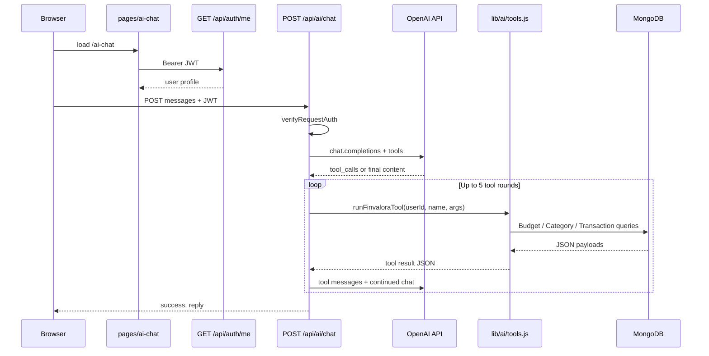

# FinValora AI Chat — Technical Specification

This document describes the **FinValora AI assistant (OpenAI + user data)** as implemented in this repository: routes, tools, data access, limits, security, and the web UI. It is intended for engineers maintaining or extending the feature.

---

## 1. Purpose and scope

- **Goal:** Give **authenticated** users a conversational assistant that answers questions about their **categories**, **income/expense transactions**, **current-month budget**, and **report-style aggregates** over a date range. Answers are grounded in MongoDB via **OpenAI function calling** (tools), not free-form guesses about amounts or category names.
- **In scope (implemented):**
  - Server-side OpenAI Chat Completions with tools.
  - Read-only access to the signed-in user’s `Budget`, `Category`, and `Transaction` documents.
  - Single-page chat UI at `/ai-chat` with JWT-protected API calls.
- **Out of scope (not implemented):**
  - Creating, updating, or deleting transactions or categories via chat.
  - Streaming responses (SSE); responses are returned as one JSON payload per turn.
  - Multi-tenant or cross-user data access.
  - Storing chat history in the database (history exists only in the browser session for the current page).

---

## 2. High-level architecture



| Layer | Responsibility |
|--------|------------------|
| **UI** | [`pages/ai-chat/index.js`](../pages/ai-chat/index.js) — auth gate, message list, input, `authenticatedFetch` to chat API. |
| **API** | [`pages/api/ai/chat.js`](../pages/api/ai/chat.js) — JWT verification, sanitization, OpenAI client, tool loop. |
| **Tools** | [`lib/ai/tools.js`](../lib/ai/tools.js) — Mongo queries scoped by `userId` from auth. |
| **Auth** | [`middleware/auth.js`](../middleware/auth.js) — `verifyRequestAuth` (Bearer token or cookie). |

---

## 3. Configuration and environment

| Variable | Required | Description |
|----------|----------|---------------|
| `OPENAI_API_KEY` | Yes (for chat to work) | Server-only secret. Never expose to the client or commit to git. |
| `OPENAI_MODEL` | No | Overrides default `gpt-4o-mini`. |
| `MONGODB_URI` | Yes (app-wide) | Used when the chat route calls `connectDB()`. |

See also [`.env.example`](../.env.example) for placeholders.

---

## 4. HTTP API: `POST /api/ai/chat`

### 4.1 Authentication

- Same as other protected APIs: `Authorization: Bearer <JWT>` (and optional cookie path supported by `verifyRequestAuth`).
- **401** if the token is missing, invalid, or the user is inactive.

### 4.2 Request

- **Method:** `POST` only (**405** otherwise).
- **Content-Type:** `application/json`.
- **Body:**

```json
{
  "messages": [
    { "role": "user", "content": "What are my expense categories?" },
    { "role": "assistant", "content": "…" }
  ]
}
```

- **Rules:**
  - Only `role` values **`user`** and **`assistant`** are accepted from the client; other roles are dropped.
  - Each `content` string is truncated to **4,000** characters.
  - Only the last **40** messages (after sanitization) are sent to the model (in addition to the server-built system message).

### 4.3 Body size limit

- API route config sets **`bodyParser.sizeLimit`: `256kb`**.

### 4.4 Success response

**200** — JSON:

```json
{
  "success": true,
  "reply": "Assistant text shown in the UI."
}
```

If the model returns empty content, the API substitutes a short fallback string asking the user to rephrase.

### 4.5 Error responses

| Status | When |
|--------|------|
| **400** | No valid messages after sanitization. |
| **401** | Auth failure. |
| **405** | Not `POST`. |
| **502** | OpenAI error, empty choice, or too many tool rounds (see below). |
| **503** | `OPENAI_API_KEY` is not set on the server. |

Error shape: `{ "success": false, "message": "…" }`.

### 4.6 System prompt (server-built)

Built in `buildSystemPrompt(auth user)` with:

- Product identity (FinValora budgeting assistant).
- Instruction to use tools and **not invent** financial figures or category names.
- User display name (first + last), **currency** code for labeling, and **reference date (UTC)** as `YYYY-MM-DD`.
- Disclaimer: not a financial advisor; no investment/tax/legal advice.

---

## 5. OpenAI integration

- **SDK:** `openai` npm package; client instantiated per request with `OPENAI_API_KEY`.
- **Endpoint:** `openai.chat.completions.create` with `tools` and `tool_choice: 'auto'`.
- **Tool loop:** Up to **5** rounds. Each round: if the assistant message includes `tool_calls`, the server runs each tool, appends `role: 'tool'` messages with `JSON.stringify(result)`, and calls the API again. If there are no tool calls, the server returns the assistant’s text content.
- **Exceeded rounds:** **502** with message *Too many tool rounds; try a simpler question.*

---

## 6. Tools (function calling)

All tools execute **only** for the authenticated `userId`. Unknown tool names return `{ ok: false, error: "Unknown tool: …" }`.

### 6.1 `get_current_budget`

- **Parameters:** none (empty object).
- **Behavior:** `Budget.findCurrentBudget(userId)` — active budget for **current calendar month/year** (see `models/Budget.js`).
- **Success:** `{ ok: true, budget: { …getSummary(), budgetMonth, budgetYear } }`.
- **No budget:** `{ ok: false, message: "No active budget found for the current calendar month" }`.

### 6.2 `list_categories`

- **Parameters:** optional `type`: `"Income"` | `"Expense"`.
- **Behavior:** If `type` set, `Category.findByType`; else `Category.findUserCategories`.
- **Success:** `{ ok: true, categories: [ getSummary() … ] }` (id, name, type, color, icon, description).

### 6.3 `query_transactions`

- **Parameters:** `startDate`, `endDate` (ISO strings, required); optional `type` (`Income` / `Expense`); optional `limit` (default 50, **hard cap 100**).
- **Behavior:** `Transaction.find` by `userId` and date range, `populate('categoryId', 'name type color')`, sort `date` descending, `limit`.
- **Success:** `{ ok: true, count, limit, transactions: [{ id, amount, description, type, date, currency, category }] }`.
- **Validation errors:** `{ ok: false, error: "…" }` for missing/invalid dates.

### 6.4 `get_period_report`

- **Parameters:** `startDate`, `endDate` (required).
- **Behavior:** Loads transactions in range with `populate('categoryId', 'name type')`, **max 2,000** rows (`MAX_REPORT_TX`), then aggregates in memory (same idea as the Reports page: totals and per-category breakdowns).
- **Success:** includes `transactionCountIncluded`, `cappedAt: 2000`, `period`, `totalIncome`, `totalExpenses`, `netSavings`, `incomeByCategory`, `expenseByCategory`, `topExpenseCategories` (top 10 expense categories by amount).

**Note:** If a user has more than 2,000 transactions in the range, aggregates reflect only the included subset; the model can be informed via `transactionCountIncluded` and `cappedAt`.

---

## 7. Client UI (`/ai-chat`)

- **File:** [`pages/ai-chat/index.js`](../pages/ai-chat/index.js).
- **Layout:** `AppSidebar` + app header styling consistent with other logged-in pages (`fv-app-page-header`).
- **Auth:** On mount, `GET /api/auth/me` via `authenticatedFetch`; redirect to `/login` if not OK.
- **State:** Local `messages` array (`user` / `assistant` only); each send appends the user message, then `POST /api/ai/chat` with the full history, then appends the assistant `reply`.
- **UX:** Scroll-to-bottom on new messages, loading state while waiting, inline error banner for API errors, disclaimer that output is informational and not financial advice; optional display of user currency from profile.
- **Navigation:** Linked from [`components/AppSidebar.js`](../components/AppSidebar.js) (`href="/ai-chat"`).

---

## 8. Security and privacy

- **API key:** Only read from `process.env` on the server; never sent to the browser.
- **Data isolation:** Every tool uses `userId` from `verifyRequestAuth`; no user-supplied user id in the request body.
- **Client trust:** Message content is sanitized (role + length + count) but user text is still sent to OpenAI; treat as **third-party processing** for privacy and compliance reviews.
- **Read-only tools:** The assistant cannot mutate financial data through the tool layer; any future write tools would need explicit design (validation, idempotency, audit).

---

## 9. Operational considerations

- **Cost:** Driven by model choice, conversation length, and number of tool rounds per turn.
- **Reliability:** OpenAI outages or rate limits surface as **502** with `err.message` when available.
- **Logging:** Failed OpenAI calls are logged server-side (`console.error('OpenAI chat error:', err)`).

---

## 10. Future extensions (not implemented)

- Server-persisted chat threads per user.
- Response streaming (SSE) for lower perceived latency.
- Optional tools to create transactions with strict validation and confirmation.
- Rate limiting per user or IP on `/api/ai/chat`.
- Stronger date handling when the user says “this month” (e.g. inject explicit range server-side based on timezone).

---

## 11. File index

| Path | Role |
|------|------|
| `pages/ai-chat/index.js` | Chat page UI |
| `pages/api/ai/chat.js` | Chat API handler |
| `lib/ai/tools.js` | Tool implementations and `runFinvaloraTool` |
| `middleware/auth.js` | `verifyRequestAuth` |
| `models/Budget.js` | `findCurrentBudget`, `getSummary` |
| `models/Category.js` | `findByType`, `findUserCategories`, `getSummary` |
| `models/Transaction.js` | Transaction queries used by tools |

---

*This spec reflects the implementation in the repository at documentation time; update it when behavior changes.*
