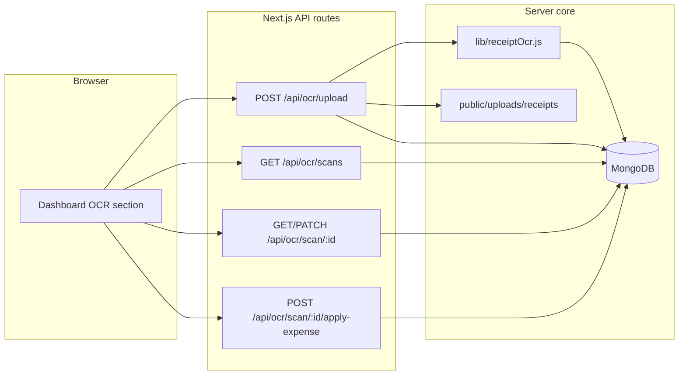

# FinValora Receipt OCR — Technical Specification

This document describes the **receipt OCR feature as implemented** in this repository: libraries, APIs, data models, parsing behavior, dashboard UX, and known limitations. It is intended for engineers maintaining or extending the feature.

---

## 1. Purpose and scope

- **Goal:** Let authenticated users upload a receipt image or text-based PDF, run server-side text extraction, derive structured fields (amount, date, merchant, suggested category, currency), store a durable **OCR scan** record, and optionally **create an expense transaction** linked to that scan.
- **Out of scope (not implemented):** Client-side OCR, cloud vision APIs (Google Vision, Textract, etc.), training custom models, multi-language OCR beyond Tesseract English for images, OCR of image-only (scanned) PDFs.

---

## 2. High-level architecture

- **Primary UI:** Dashboard (`pages/dashboard/index.js`), section id `ocr-scanner-section`.
- **Legacy route:** `pages/ocr-scanner/index.js` immediately redirects to `/dashboard`.

---

## 3. Dependencies

| Package        | Role |
|----------------|------|
| `tesseract.js` | OCR for raster images (`image/*`). Worker language: **`eng`**. |
| `pdf-parse`    | Text extraction for **`application/pdf`** (embedded/selectable text only). |
| `formidable`   | Multipart upload parsing in `POST /api/ocr/upload`. |

---

## 4. File handling and storage

### 4.1 Upload constraints (`pages/api/ocr/upload.js`)

- **Max size:** 10 MB (`maxFileSize: 10 * 1024 * 1024`).
- **Allowed MIME types:** `image/*`, `image/webp`, `application/pdf` (via formidable `filter`).
- **Field name:** `receipt` (multipart form field).
- **Storage directory:** `public/uploads/receipts/` (created if missing).
- **Saved filename pattern:** `receipt_{userId}_{timestamp}{ext}` (extension from original file when present).
- **Public URL pattern:** `/uploads/receipts/{filename}` stored on `OCRScan.originalFile.url`.

### 4.2 Path safety (`lib/receiptOcr.js`)

- `resolveReceiptAbsolutePath(filename)` rejects paths containing `..` and resolves only under `public/uploads/receipts/` via `path.basename`.

---

## 5. Processing pipeline

### 5.1 Order of operations (`POST /api/ocr/upload`)

1. Authenticate request (`verifyRequestAuth`).
2. Parse multipart form; require file `receipt`.
3. Move uploaded temp file to `public/uploads/receipts/{filename}`.
4. Create `OCRScan` with `status: 'processing'` and file metadata; **persist**.
5. Call `runReceiptOcr({ absolutePath, mimetype })`.
6. On success: set `status: 'completed'`, store `rawText`, `extractedData`, `overallConfidence`, `processingTime`, `ocrEngine`, clear `error`.
7. On failure: set `status: 'failed'`, set `error: { message, code: 'OCR_ERROR' }`, store `processingTime`.
8. Respond **201** with `scanId`, `scan: ocrScan.getSummary()`, and a user-facing `message`.

**Note:** OCR runs **synchronously** in the upload request; large images may increase latency.

### 5.2 Engines (`runReceiptOcr`)

| Input type        | Engine        | Behavior |
|-------------------|---------------|----------|
| `mimetype` includes `pdf` | `pdf-parse`   | Reads PDF buffer; if extracted text is empty or very short (`< 8` chars), prepends a warning line that scanned PDFs should be exported as images for better results. |
| `mimetype` starts with `image/` | `tesseract`   | `createWorker('eng')`, `recognize(absolutePath)`, `terminate()`. |
| Other             | —             | Throws `Unsupported file type for OCR`. |

---

## 6. Text parsing and field extraction (`parseReceiptText`)

All structured fields are produced by **heuristics** on `rawText` (line-split, trimmed). There is **no** ML-based NER in this codebase.

### 6.1 Amount (`pickAmount`)

1. **Line patterns** (case-insensitive), examples:
   - `total`, `balance due`, `amount due`, `grand total`, `subtotal`, `amt` + numeric capture.
   - Currency prefixes: `PKR`, `Rs`, `USD`, `$`, `€`, `£` + amount.
2. **Fallback:** Global regex on full text for money-like tokens; picks the **largest** plausible value in `(0, 1e7)`.
3. **Parsing:** `parseMoney` strips spaces/commas, `parseFloat`.

### 6.2 Date (`pickDate`)

- Patterns: `d/m/y`, `d-m-y`, `d.m.y`, and `y-m-d` style on lines first, then full text.
- `tryParseDate` normalizes separators; handles some 2-digit years via `2000 + c`.
- **Default:** If nothing matches, uses **`new Date()`** (today) as `value` (see code: always returns a date object from `pickDate`).

### 6.3 Merchant (`pickMerchant`)

- Scans first ~12 non-empty lines; skips numeric-only lines and lines matching a **skip** prefix list (`receipt`, `invoice`, `tax`, `date`, `tel`, `http`, `thank`, card brands, etc.).
- First plausible alphabetic line (length 3–80) wins, truncated to 100 chars.
- Otherwise: **`Unknown merchant`**.

### 6.4 Category guess (`guessCategory`)

Keyword buckets on full lowercased text (suggested **labels**, not FinValora category IDs):

| Keywords (examples) | Suggested label   | Confidence |
|---------------------|-------------------|------------|
| restaurant, cafe, food, dining, … | Food & Dining | 55 |
| fuel, gas, petrol, shell, … | Transport | 50 |
| pharmacy, medical, clinic, … | Health | 50 |
| grocery, supermarket, mart, … | Groceries | 50 |
| (default) | General expense | 35 |

**Important:** Expense creation uses the user’s **real** `Category` documents from `/api/categories?type=Expense`; the OCR “category” field is **informational** unless the UI maps it (current dashboard uses manual category dropdown only).

### 6.5 Currency guess

- `PKR` / `Rs` → `PKR`
- `$` + digit pattern → `USD`
- `€` → `EUR`
- Else → `USD`

### 6.6 Per-field and overall confidence

- **Overall score** (`overallConfidence`): heuristic sum capped at **95** (base 40 + amount + merchant + date + line-count bonus). This is **not** Tesseract’s native confidence for the whole document (Tesseract confidence is not wired through for images).
- **Stored per-field confidences** in `extractedData` use fixed or bucket values (e.g. amount 72/20, merchant 68/30, date 65, category from `guessCategory`).

---

## 7. Data model: `OCRScan` (`models/OCRScan.js`)

### 7.1 Key fields

- `userId` (ObjectId, indexed)
- `originalFile`: `filename`, `originalName`, `mimetype`, `size`, `url`
- `status`: `pending` | `processing` | `completed` | `failed` (upload flow uses `processing` → `completed`/`failed`)
- `rawText`, `extractedData` (nested amount/merchant/date/category/currency + optional tax/tip/subtotal placeholders)
- `overallConfidence`, `processingTime` (ms), `ocrEngine`
- `isReviewed`, `isApproved`, `userCorrections`
- `transactionId` (set when an expense is created from the scan)
- `error`: `{ message, code, details? }`

### 7.2 Indexes

- `{ userId: 1, createdAt: -1 }`, `{ userId: 1, status: 1 }`, `{ userId: 1, isReviewed: 1 }`

### 7.3 Static helpers

- `getRecentScans(userId, limit)` — all scans for user, newest first.
- `getPendingScans(userId)` — `status` in `pending`, `processing`.
- `getScansNeedingReview(userId)` — `completed` and `isReviewed: false`.

### 7.4 Instance methods

- `markAsReviewed(approved, corrections)` — sets flags and optional `userCorrections`.
- `getSummary()` — **API-safe** summary (includes `extractedData`, **not** `rawText`):
  - `id`, `filename` (original name), `status`, `extractedData`, `overallConfidence`, `isReviewed`, `isApproved`, `createdAt`, `hasTransaction`, `error`
- `isDataReliable(threshold)` — compares `overallConfidence` to threshold (default 70).

---

## 8. Data model: `Transaction` OCR linkage (`models/Transaction.js`)

Fields used when creating an expense from OCR:

- `isFromOCR: true`
- `notes`: `From OCR scan {scanId}`
- `merchant`, `description`, `amount`, `date`, `currency`, `categoryId`, `budgetId` as per apply-expense logic.

The schema also defines optional `ocrData` (confidence, `originalText`, `extractedFields`); **the current `apply-expense` handler does not populate `ocrData`**—only `isFromOCR` and `notes` tie the transaction to the scan.

---

## 9. HTTP API reference

All routes use **`verifyRequestAuth`** unless noted. Typical client: `Authorization: Bearer <token>` (dashboard uses `localStorage.finvalora_token` for upload `fetch` and `authenticatedFetch` elsewhere).

### 9.1 `POST /api/ocr/upload`

- **Body:** `multipart/form-data`, field **`receipt`**.
- **Config:** `bodyParser: false`, `responseLimit: false`.
- **201:** `{ success, message, scanId, scan }` where `scan` is `getSummary()`.
- **401:** Unauthenticated.
- **400:** No file, file too large, unexpected field (formidable), invalid type.
- **500:** Generic upload failure.

### 9.2 `GET /api/ocr/scans`

- **Query:** `limit` (default 10), optional `status`, optional `needsReview=true` (uses `getScansNeedingReview`).
- **200:** `{ success, scans: getSummary()[] }`.

### 9.3 `GET /api/ocr/scan/[id]`

- **200:** `{ success, scan }` (`getSummary()`).
- **404:** Wrong id or not owned by user.

### 9.4 `PATCH /api/ocr/scan/[id]`

- **Body:** `{ approved?, corrections? }` — delegates to `markAsReviewed`.
- **200:** `{ success, message, scan }`.

### 9.5 `POST /api/ocr/scan/[id]/apply-expense`

- **Body:** JSON `{ categoryId` (required), `amount?`, `description?`, `merchant?`, `date?` }
  - Current dashboard sends `categoryId` and optional `amount` override only.
- **Rules:**
  - Scan must exist for `userId`, `status === 'completed'`, **`transactionId` must be null**.
  - `categoryId` must reference an **active Expense** category for that user.
  - Amount: `amount` body override, else `scan.extractedData.amount.value`; must be finite and **> 0**.
  - Date: `date` body override, else extracted date, else now; must be valid.
  - **Budget:** There must be an **active** `Budget` for `budgetYear` / `budgetMonth` derived from the transaction date; otherwise **400** `"No active budget found for this period"`.
- **Side effects:** Creates `Transaction`, increments `budget.currentSpent`, sets `scan.transactionId`, `scan.isReviewed`, `scan.isApproved`.
- **201:** `{ success, message, transaction, scan }`.

---

## 10. Dashboard UX (`pages/dashboard/index.js`)

- Loads recent scans: `GET /api/ocr/scans?limit=10` after budget exists.
- Loads expense categories: `GET /api/categories?type=Expense`.
- **Upload:** hidden file input; `POST /api/ocr/upload` with `FormData` and bearer token; refreshes scan list; selects new scan when `scan.id` returned.
- **Selection:** User picks a scan from recent list; amount field prefilled from `extractedData.amount.value` (editable override).
- **Apply expense:** `POST /api/ocr/scan/:id/apply-expense` with `categoryId` and optional `amount`; shows messages for duplicate link, missing category, budget missing, etc.
- **Sidebar:** `AppSidebar` optional `onOcrClick` scrolls to `#ocr-scanner-section`.

---

## 11. Security and privacy

- Scans and transactions are **scoped by `userId`** on all queries.
- Upload path cannot escape `uploads/receipts` via `filename` (basename + no `..`).
- **`getSummary()` does not expose `rawText`** to list/detail API consumers; full document including `rawText` remains in MongoDB for support/debug (consider redaction or retention policy for production compliance).
- Receipt files are stored under **`public/`**; URLs are guessable if filename leaks—mitigate with auth on app routes and/or move to non-public storage if required.

---

## 12. Known limitations (as implemented)

1. **Image-only PDFs:** No rendering to image; `pdf-parse` often yields little text—user sees warning in `rawText` and may get poor extraction.
2. **Single language:** Tesseract worker is **`eng` only** for images.
3. **Synchronous OCR:** Long-running uploads block the HTTP response; risk of timeouts under serverless or strict proxies.
4. **Heuristic fragility:** Amount/date/merchant errors are common on noisy receipts; users should override amount and pick category manually.
5. **Category suggestion:** Not mapped to DB categories; UI does not auto-select from `extractedData.category.value`.
6. **`transaction.ocrData`:** Unused by `apply-expense` despite schema support.
7. **PATCH review endpoint:** Exposed but not wired in the current dashboard flow (review flags are set mainly via apply-expense).

---

## 13. Extension points

- **Swap engines:** `ocrEngine` string on `OCRScan` is set to `tesseract` or `pdf-parse`; can branch to cloud APIs in `runReceiptOcr` while keeping `parseReceiptText` or replacing it with API-native fields.
- **i18n:** Add Tesseract language packs and pass language from user settings.
- **Async jobs:** Move step 5–7 of upload to a queue/worker; set `status` to `processing` and poll `GET /api/ocr/scan/:id`.
- **Richer `getSummary`:** Optionally include truncated `rawText` or a signed URL for downloads behind auth.

---

## 14. File map (quick reference)

| Path | Role |
|------|------|
| `lib/receiptOcr.js` | `runReceiptOcr`, `parseReceiptText`, `resolveReceiptAbsolutePath` |
| `pages/api/ocr/upload.js` | Multipart upload + OCR pipeline |
| `pages/api/ocr/scans.js` | List scans |
| `pages/api/ocr/scan/[id].js` | Get / patch scan |
| `pages/api/ocr/scan/[id]/apply-expense.js` | Create expense from scan |
| `models/OCRScan.js` | Mongoose schema and helpers |
| `pages/dashboard/index.js` | OCR UI |
| `pages/ocr-scanner/index.js` | Redirect to dashboard |
| `components/AppSidebar.js` | Link to OCR section on dashboard |

---

*Document generated to match the codebase implementation. Update this file when OCR behavior or APIs change.*
